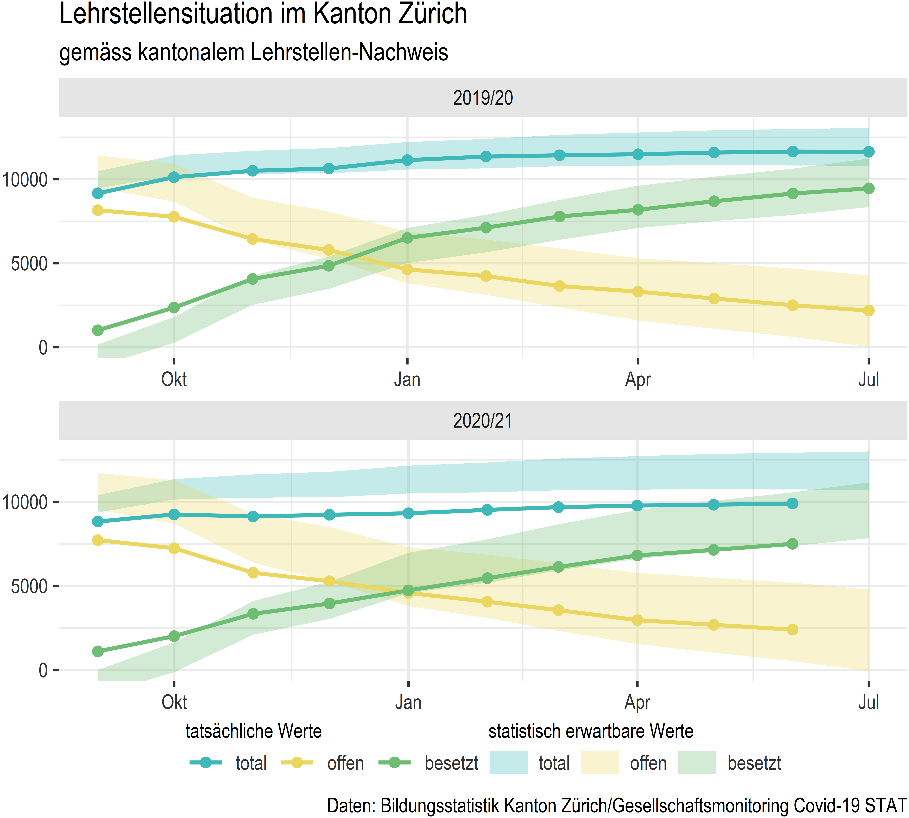

# Gesellschaftsmonitoring COVID19, Daten Bildungsstatistik

Daten der Bildungsstatistik im Rahmen des Projekts [Gesellschaftsmonitoring COVID19](https://statistikzh.github.io/covid19monitoring/)

## Datenlieferant

Kanton Zürich, Bildungsstatistik

## Beteiligte

Flavian Imlig <flavian.imlig@bi.zh.ch>, Bildungsdirektion, Bildungsplanung

## Datenbestände

### Anzahl abgeschlossener Lehrverträge

https://pub.bista.zh.ch/de/zahlen-und-fakten/andere/lehrvertraege/

Der Indikator beschreibt die Anzahl der monatlich erfassten Lehrverträge mit Lehrvertragsbeginn im gleichen Kalenderjahr. Die Anzahl ist ein Nettowert, da auch Lehrvertragsauflösungen erfasst sind. Die summierten Werte eines Kalenderjahres ergeben die Anzahl der erfassten Lehrverträge dieses Jahres.

Die bereits im Vorjahr abgeschlossenen Lehrverträge werden jeweils dem Januar des Kalenderjahres, in dem der Lehrvertragsbeginn liegt, zugeordnet. Die Anzahl der Lehrverträge ist deshalb im Januar besonders hoch.

Die Lehrverträge werden anhand des sogenannten Erfassungsdatums den Monaten zugeordnet, also dem Datum an dem sie durch das Mittelschul- und Berufsbildungsamt (MBA) erfasst werden. Dabei ist zu berücksichtigen, dass die Betriebe selber bestimmen in welchem Rhythmus sie ihre Lehrverträge dem MBA zur Erfassung übermitteln.

In den Vorjahren bestand jeweils ein Rückstand bei der Erfassung von Lehrverträgen durch das MBA. Dies war 2020 sehr viel weniger der Fall.

### offene und besetzte Lehrstellen

https://pub.bista.zh.ch/de/zahlen-und-fakten/andere/lehrstellen/

Der Indikator beschreibt die Anzahl ausgeschriebener Lehrstellen mit Lehrvertragsbeginn im kommenden Schuljahr, die noch offen oder besetzt sind.

Erfasst werden die Lehrstellen im kantonalen Lehrstellen-Nachweis [LENA](https://www.berufsberatung.ch/dyn/show/2930). Die Erfassung der Lehrstellen erfolgt jeweils per Ende Monat.

Erfasst werden nur Lehrstellen mit Lehrbeginn im jeweils kommenden August. Eine Jahreszeitreihe umfasst September bis Juli. Da im August die Umstellung auf das neue Lehrjahr erfolgt, sind die Lehrstellen nicht immer eindeutig einem Lehrjahr zuzuordnen. Die Daten des Monats August werden deshalb nicht ausgewiesen.

## Auswertungen

Es wurde allgemein erwartet, dass sich die Massnahmen, die der Bundesrat als Reaktion auf die sogenannte Corona-Krise definiert hat, unter anderem auf die Lehrstellensituation auswirken. Die Daten aus dem kantonalen Lehrstellen-Nachweis ermöglichen eine Überprüfung dieser Vermutung für den Kanton Zürich.

Insgesamt waren im Schuljahr 2019/20 bezüglich der besetzten und offenen Lehrstellen keine massiven Abweichungen gegenüber den Vorjahren zu verzeichnen. Im Schuljahr 2020/21 ist der Verlauf zwar entsprechend der modellierten Erwartung, die absoluten Zahlen liegen aber tiefer, insbesondere bei den besetzten Lehrstellen.

Die statistisch erwartbaren Werte werden mittels eines Prognosemodells auf der Basis der Daten seit 2013 berechnet.  
Zum Einsatz kommt die Methode von Holt-Winters mit additiver Saison und den Parametern $\alpha = 0.8$, $\beta = 0$ und $\gamma = 0.1$. Dargestellt sind die Werte des $95\%$-Konfidenzintervalls.
